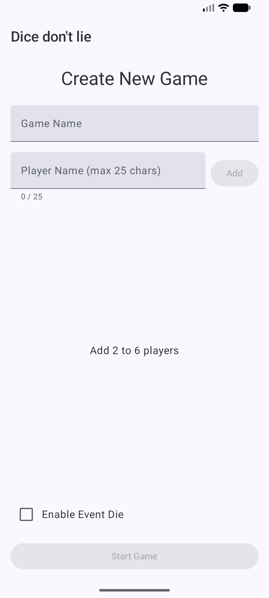
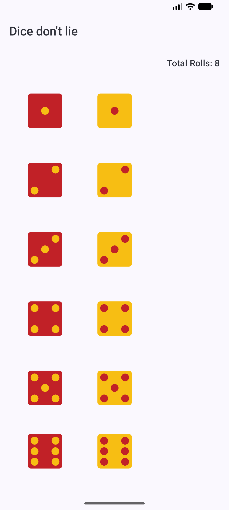
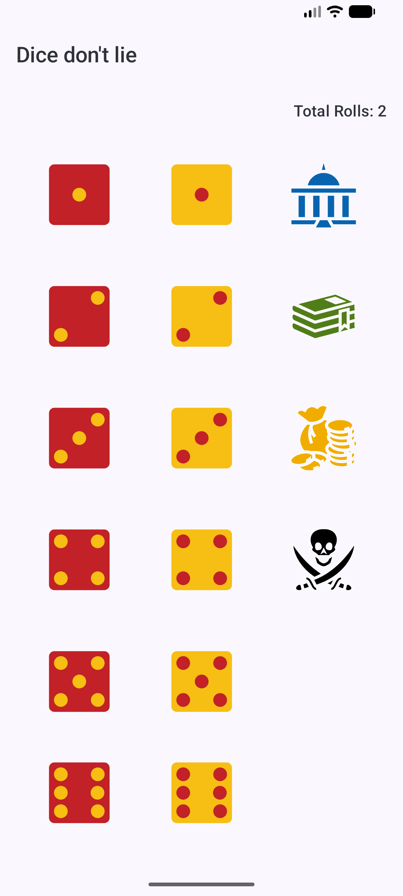
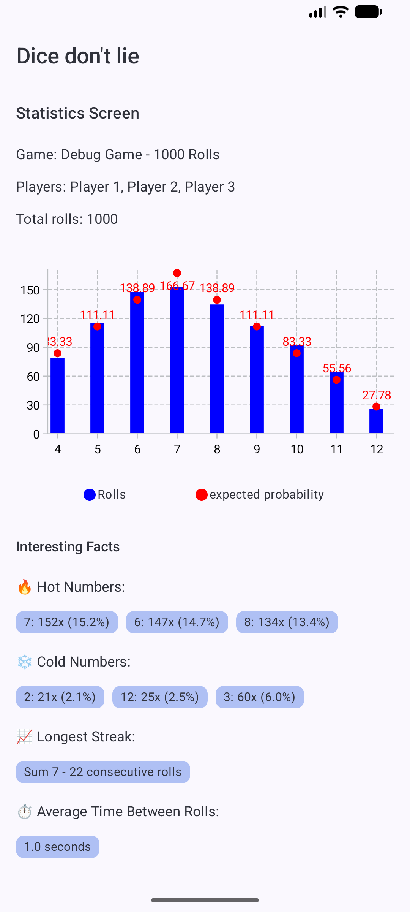
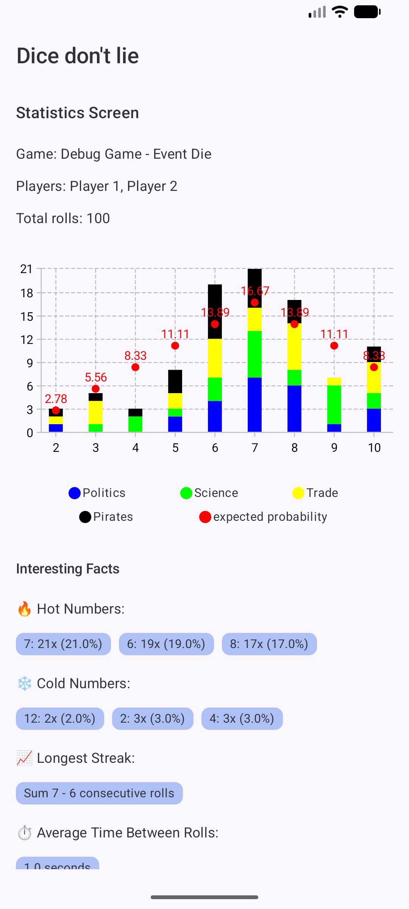
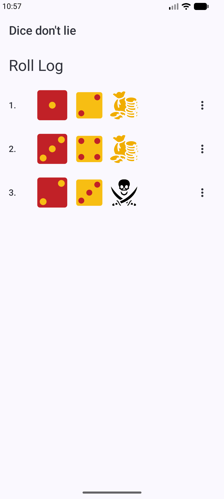

# 🎲 Dice Don’t Lie

A modern Android app for tracking dice rolls in a popular resource-trading board game.  
Create games, log dice results, and analyze roll statistics over time, because the dice *never* lie.
---

## ✨ Features

### 🎮 Game Management
- Create games with custom names and player lists
- Enable or disable the event die per game
- View start/end times and total roll counts
- Delete completed or unused games

### 🎲 Dice Rolling
- Roll red and yellow dice (values 1–6)
- Optional event die with four outcomes:
    - **POLITICS**
    - **SCIENCE**
    - **TRADE**
    - **PIRATES**
- Automatic saving once all required dice are selected
- Undo the most recent roll

### 📊 Roll Tracking & Statistics
- Chronological roll log
- Edit or delete individual rolls
- Total roll counter per game
- Visual statistics and charts

### 📱 User Experience
- Responsive layout for phones and tablets
- Color-coded dice values for quick scanning
- Snackbar confirmations for actions

---

## 🛠️ Technical Overview

### 🏗️ Architecture
- **Jetpack Compose** for modern UI
- **Room** database for local persistence
- **MVVM** architecture

### 📚 Key Libraries
- **Jetpack Compose** – Declarative UI toolkit
- **Room** – SQLite ORM
- **Navigation Compose** – Screen navigation
- [**Vico**](https://github.com/patrykandpatrick/vico) – Charts and graphs
- **AndroidX Lifecycle** – Lifecycle-aware state handling
- **AndroidX Core KTX** – Kotlin extensions

### 📦 Data Model
- **Game** – Game session metadata and settings
- **DieRoll** – Individual roll entries
- **EventDie** – Enum for event die outcomes

### 📱 App Screens
1. **Start Screen** – List and manage games
2. **New Game Screen** – Create games and manage players
3. **Game Details Screen** – Overview and navigation
4. **Die Roll Screen** – Roll dice and view recent history
5. **Roll Log Screen** – Edit and review all rolls
6. **Statistics Screen** – Visual analysis of roll data

---

## 🚀 Getting Started

### 📋 Prerequisites
- Android Studio (latest recommended)
- Android SDK 21+
- Kotlin plugin

### 🔧 Installation
1. Clone the repository
2. Open the project in Android Studio
3. Build and run

### 🎯 Usage
1. Create a new game from the start screen
2. Add 2–6 players
3. Enable the event die (optional)
4. Log dice during gameplay
5. Review roll history and statistics
6. Repeat
---

## 📸 Screenshots

<!-- Borderless tables using HTML for consistent image sizing -->

<h3>Create Game</h3>
<table>
  <tr>
    <td>
      
    </td>
  </tr>
</table>

<h3>Die Roll</h3>
<table>
  <tr>
    <td>
      
    </td>
    <td>
      
    </td>
  </tr>
</table>

<h3>Statistics</h3>
<table>
  <tr>
    <td>
      
    </td>
    <td>
      
    </td>
  </tr>
</table>

<h3>Roll log</h3>
<table>
  <tr>
    <td>
      
    </td>
  </tr>
</table>

---

## 📜 License

Licensed under the **zlib License**.  
See the [LICENSE](LICENSE.md) file for details.

---

## 🤝 Contributing

Contributions are welcome!  
Feel free to open an issue or submit a pull request for improvements or bug fixes.

---

## 🙏 Acknowledgements

- Icons from [game-icons.net](https://game-icons.net/)  
  Licensed under **CC BY 3.0**
